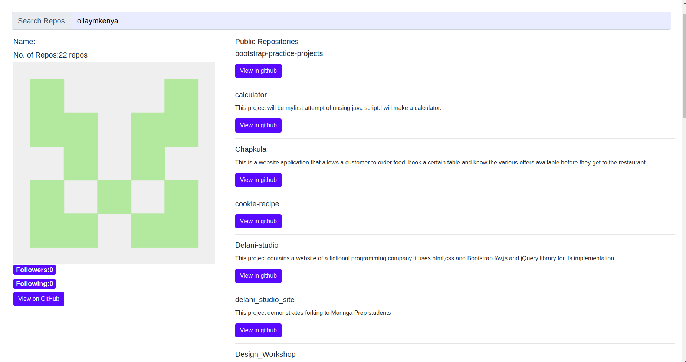

# GitHubSearch
#### This app take an input of a a string that searches the repo of a person in Github(15/07/2019)

#### By **Muriithi Oliver Njuguna**

## Description

Hello,welcome to the GitSearch app.This app is supposed to  take an input of a a string that searches the repo of a person in Github..

## Setup/Installation Requirements for users
-   Copy the link provided in the description section
-   Paste it in your favorite browser
-   Search
-   Follow the instructions given in the web page once opened

## Setup/Installation Requirements for developers

-   Fork this remote repository into your account
-   Clone the app using the clone link provided https://github.com/ollaymkenya/Git-Search.git
-   open your terminal and it should be in your local repository
-   open your favorite text editor
-   copy the index.html file location and load it in your favorite browser

## Known Bugs

Currently i have no known Bugs.However i have links to pages not yet created.This will however, soon be resolved

## Technologies Used

HTML markup language
CSS styling language
Typescript for scripting
Bootstrap framework for styling
Angular framework

This project was generated with [Angular CLI](https://github.com/angular/angular-cli) version 8.0.4.

## Development server

Run `ng serve` for a dev server. Navigate to `http://localhost:4200/`. The app will automatically reload if you change any of the source files.

## Code scaffolding

Run `ng generate component component-name` to generate a new component. You can also use `ng generate directive|pipe|service|class|guard|interface|enum|module`.

## Build

Run `ng build` to build the project. The build artifacts will be stored in the `dist/` directory. Use the `--prod` flag for a production build.

## Running unit tests

Run `ng test` to execute the unit tests via [Karma](https://karma-runner.github.io).

## Running end-to-end tests

Run `ng e2e` to execute the end-to-end tests via [Protractor](http://www.protractortest.org/).

## Further help

To get more help on the Angular CLI use `ng help` or go check out the [Angular CLI README](https://github.com/angular/angular-cli/blob/master/README.md).

### License

**MIT License**

2019 **Muriithi Oliver Njuguna**

Permission is hereby granted, free of charge, to any person obtaining a copy
of this software and associated documentation files (the "Software"), to deal
in the Software without restriction, including without limitation the rights
to use, copy, modify, merge, publish, distribute, sublicense, and/or sell
copies of the Software, and to permit persons to whom the Software is
furnished to do so, subject to the following conditions:

The above copyright notice and this permission notice shall be included in all
copies or substantial portions of the Software.

THE SOFTWARE IS PROVIDED "AS IS", WITHOUT WARRANTY OF ANY KIND, EXPRESS OR
IMPLIED, INCLUDING BUT NOT LIMITED TO THE WARRANTIES OF MERCHANTABILITY,
FITNESS FOR A PARTICULAR PURPOSE AND NONINFRINGEMENT. IN NO EVENT SHALL THE
AUTHORS OR COPYRIGHT HOLDERS BE LIABLE FOR ANY CLAIM, DAMAGES OR OTHER
LIABILITY, WHETHER IN AN ACTION OF CONTRACT, TORT OR OTHERWISE, ARISING FROM,
OUT OF OR IN CONNECTION WITH THE 
SOFTWARE OR THE USE OR OTHER DEALINGS IN THE
SOFTWARE.
Copyright (c) 2019 
**Muriithi Oliver Njuguna**
